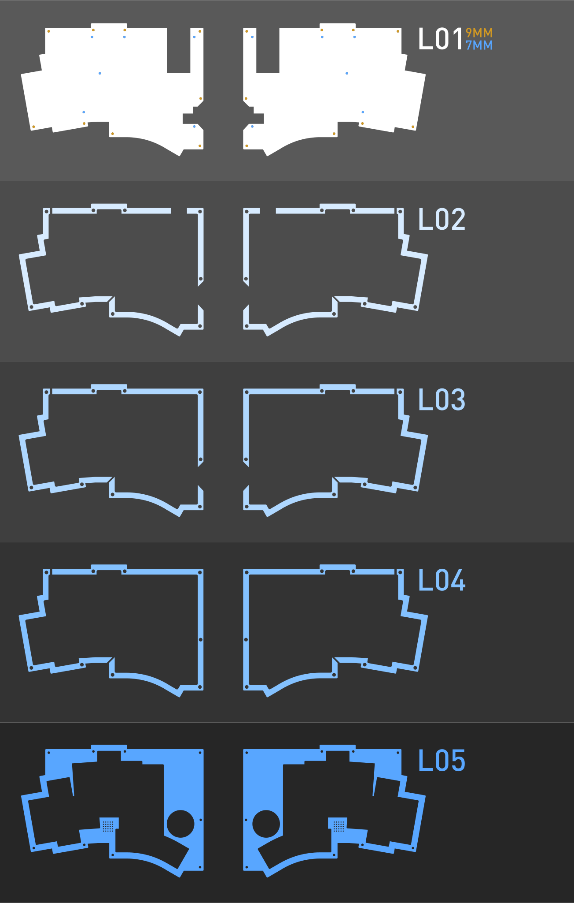

# KLOR KONRAD STACKED ACRYLIC CASE

You can choose a bottom which supports the SplitKB tenting puck or a top which features the KLOR logotype. The rest of the layers are identical.\
The middle layers got two cuts, which should make it possible to use less acrylic and make it a lot cheaper to cut.\
To get the best price you can either use a vector software like [Adobe Illustrator](https://www.adobe.com/products/illustrator.html) or [inkscape](https://inkscape.org/) to stack the parts as close together as you can or use a nesting software like [Deepnest](https://deepnest.io/), which can do it automatically.

Here you can see a guide, which should help you putting the different pieces together.

