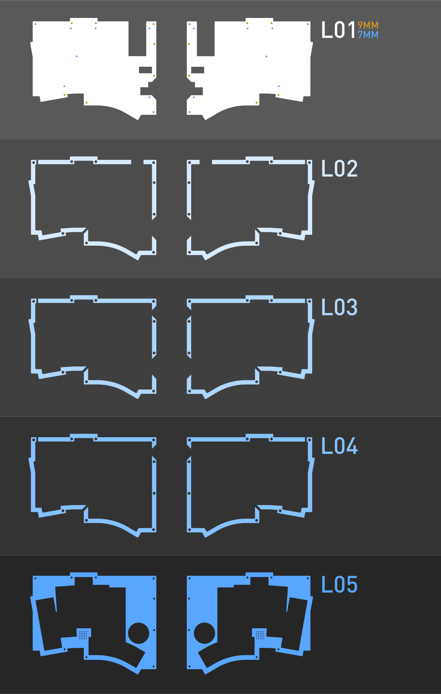

# KLOR SAEGEWERK BLE STACKED ACRYLIC CASE

You can choose a bottom which supports the SplitKB tenting puck or a top which features the KLOR logotype. The rest of the layers are identical.\
The thickness of the acrylic should be 3mm.\

You should choose a dark smokey acrylic glass like 7C83 from Plexiglass to hide the OLED, while you can still see it's light shine through the top layer.\
The middle layers got two cuts, which should make it possible to use less acrylic and make it a lot cheaper to cut.\
To get the best price you can either use a vector software like [Adobe Illustrator](https://www.adobe.com/products/illustrator.html) or [inkscape](https://inkscape.org/) to stack the parts as close together as you can or use a nesting software like [Deepnest](https://deepnest.io/), which can do it automatically.

Here you can see a guide, which should help you putting the different pieces together.

